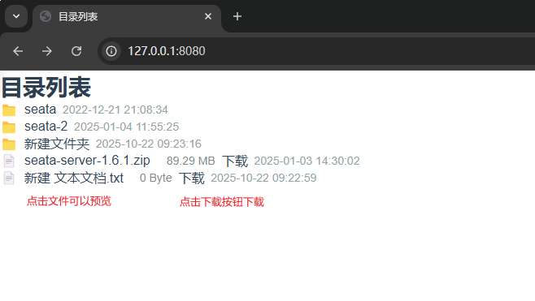

# Go-Download-Static-Files
Go Download Static Files，使用 Go 实现静态文件下载服务（类似 Nginx 静态文件服务），解决中文文件名下载问题

# 使用
```
默认当前目录，默认端口 8080
Go-Download-Static-Files
Go-Download-Static-Files -port=8080 -root="D:\temp\seata"
Go-Download-Static-Files --port=8080 --root="D:\\temp\\seata"
```
注意事项：  
根目录下不要存在"download"、"view"目录，解析会报错。

# 示意图

